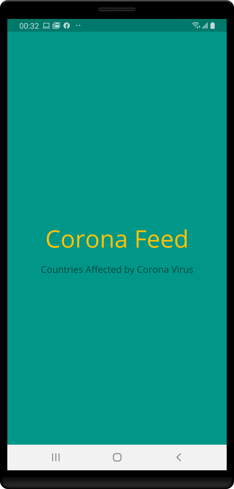
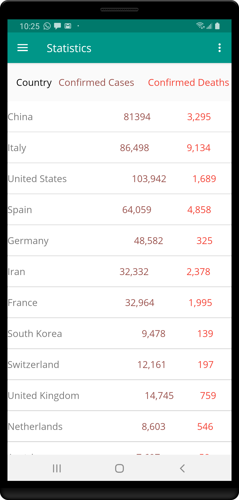
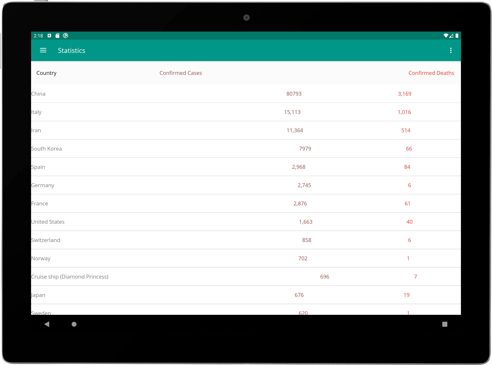
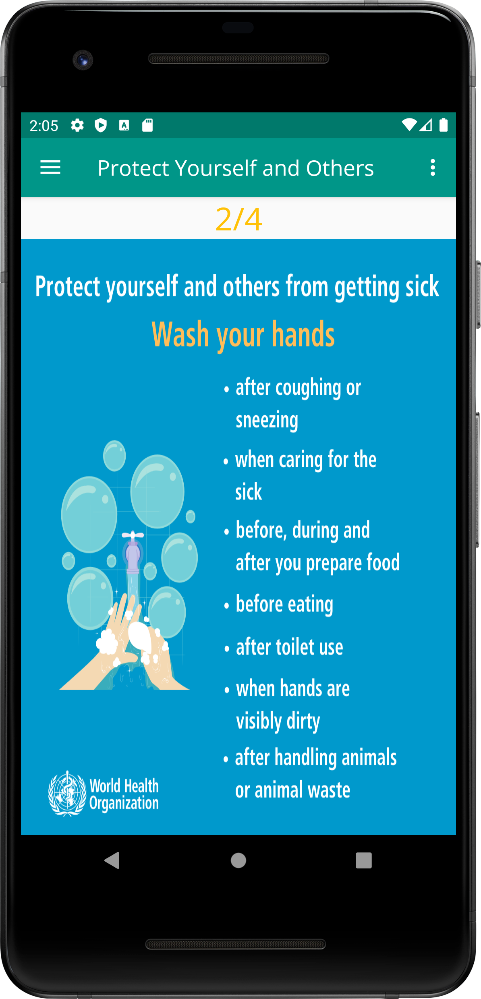
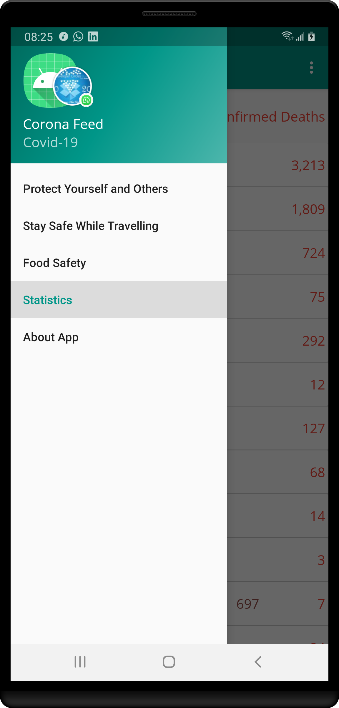
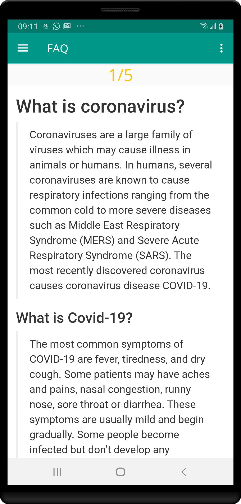

## Corona Feed

Corona Feed is android app that serves major purposes being as follows

- [ ] Curates data about updated feed about COVID-19 worldwide
- [ ] Data gotten from WHO website offline to answer some frequently ask questions about COVID-19
- [ ] Image presentations instructing users on different aspects like protecting themeselves and how to be careful

## Get the Apk
Get the apk here, [App](app/release/CoronaFeed.apk)

### App Screens

## SplashActivity

## Statistics Phone View

## Statistics Tablet

Let us be safe

I was able to get the feed from https://infographics.channelnewsasia.com . A big thanks to the website for making the data public and also the [WHO Website](https://www.who.int/) for the images made public.
